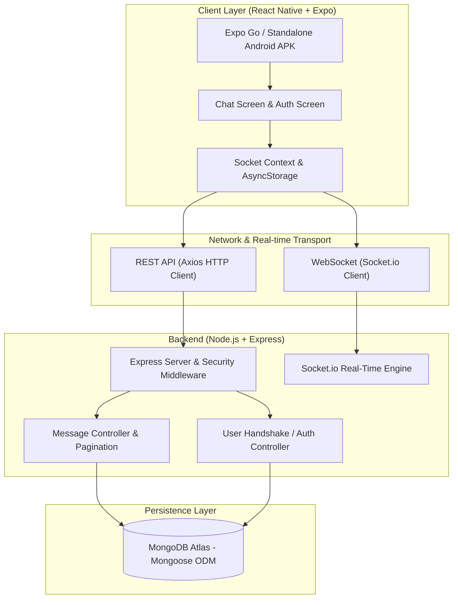

# Chatzy 💬 — Real-Time Production Chat Application

> **Vedaz Assessment Submission**  
> **Role:** Software Developer  
> **Candidate:** Jay Prajapati  
> **Repository:** Chatzy (Full-Stack Real-Time Mobile Chat)  

---

## 📋 Table of Contents
1. [Overview](#-overview)
2. [Tech Stack & Architecture](#-tech-stack--architecture)
3. [Features & Capabilities](#-features--capabilities)
4. [Project Structure](#-project-structure)
5. [Prerequisites](#-prerequisites)
6. [Local Development Setup](#-local-development-setup)
   - [1. Backend Setup](#1-backend-setup)
   - [2. Frontend (Expo) Setup](#2-frontend-expo-setup)
   - [3. Running on Physical Mobile via Expo Go](#3-running-on-physical-mobile-via-expo-go-crucial)
7. [API Documentation](#-api-documentation)
8. [WebSocket Event Specification](#-websocket-event-specification)
9. [Deployment Guide](#-deployment-guide)
   - [Backend Deployment (Render)](#backend-deployment-render)
   - [Mobile APK Build (Expo EAS)](#mobile-apk-build-expo-eas)
10. [Troubleshooting & Common Pitfalls](#-troubleshooting--common-pitfalls)
11. [License](#-license)

---

## 🌟 Overview

**Chatzy** is a production-grade, full-stack real-time chat application built specifically for the Vedaz Software Developer technical assessment. The platform is designed with resilient WebSocket architecture, optimistic UI updates, persistent message history via MongoDB Atlas, instant reconnection recovery, and a polished WhatsApp-inspired modern aesthetic.

---

## 🛠 Tech Stack & Architecture

### System Architecture Diagram



### Technology Breakdown

| Component | Technologies & Libraries |
|---|---|
| **Mobile Frontend** | React Native, Expo SDK, `socket.io-client` (v4), `axios`, `@react-native-async-storage/async-storage`, `expo-status-bar`, `react-native-safe-area-context` |
| **Backend API** | Node.js, Express.js, Socket.io (v4), Mongoose (ODM), Helmet, CORS, Dotenv |
| **Database** | MongoDB Atlas (Cloud Database Cluster) |
| **Deployment** | Render (Web Service for Backend), Expo EAS Cloud Build (Android APK) |

---

## ✨ Features & Capabilities

- **Real-Time Bidirectional Messaging**: Instant message delivery using WebSocket (`socket.io`).
- **Optimistic UI Updates**: Local temporary IDs render messages immediately with a pending state, then seamlessly transition to sent/persisted status upon server acknowledgment.
- **Connection Health & Resilient Reconnection**: Persistent status banner displaying *Connected*, *Connecting...*, and *Offline*, with manual retry options and queue flushing.
- **Deduplication Engine**: Client-side message deduplication preventing repeated messages on reconnect or race conditions.
- **Typing Indicators**: Real-time broadcast of users actively typing with automatic debounce timeout.
- **Message History & Infinite Scroll**: Paginated REST API with query cursor/limit, loading older chat messages on demand.
- **Presence Tracking**: Real-time tracking and broadcasting of online/active users.
- **Responsive WhatsApp Theme**: Curated dark/emerald color palette, clean chat bubbles, date separators, and haptic-ready interactions.

---

## 📁 Project Structure

```
Chatzy/
├── Backend/
│   ├── .env                    # Secret environment config (gitignored)
│   ├── .env.example            # Environment template for developers
│   ├── .gitignore              # Node & environment exclusion list
│   ├── package.json            # Backend scripts and dependencies
│   ├── public/
│   │   └── test/
│   │       └── test-client.html # Browser-based real-time testing harness
│   └── src/
│       ├── server.js           # Server bootstrap & WebSocket event orchestrator
│       ├── config/
│       │   └── db.js           # MongoDB Atlas connection & error handlers
│       ├── controllers/
│       │   └── messageController.js # REST endpoints for message history
│       ├── models/
│       │   └── Message.js      # Mongoose Schema with indexes & timestamps
│       └── routes/
│           └── messageRoutes.js # Express router definitions
│
├── Frontend/
│   ├── App.js                  # App root with SafeAreaProvider & AuthProvider
│   ├── app.json                # Expo configuration & Android package details
│   ├── eas.json                # Expo Application Services build configuration
│   ├── babel.config.js         # Babel presets
│   ├── package.json            # Frontend dependencies & scripts
│   ├── .env                    # Expo public environment variables
│   ├── .env.example            # Frontend environment variable sample
│   ├── .gitignore              # React Native git ignore rules
│   └── src/
│       ├── api/
│       │   └── client.js       # Axios base instance configured with dynamic baseURL
│       ├── context/
│       │   └── AuthContext.js  # Global session state & AsyncStorage persistence
│       ├── hooks/
│       │   └── useSocket.js    # Resilient Socket.io connection hook & lifecycle
│       ├── screens/
│       │   ├── LoginScreen.js  # Username onboarding screen
│       │   └── ChatScreen.js   # Real-time chatroom interface
│       ├── components/
│       │   ├── MessageBubble.js     # Chat bubble with status indicators & timestamps
│       │   ├── ConnectionBanner.js  # Reconnection alert banner
│       │   ├── TypingIndicator.js   # Animated typing status indicator
│       │   └── DateSeparator.js     # Date partition labels
│       └── utils/
│           └── constants.js    # Design tokens, color palette, and storage keys
│
└── README.md                   # Complete technical documentation
```

---

## ⚙️ Prerequisites

Make sure you have installed:
- **Node.js**: v18.x or v20.x ([Download Node.js](https://nodejs.org/))
- **npm** or **yarn**
- **Git**: For version control
- **Expo Go App**: Installed on your physical Android/iOS phone (via Google Play Store or Apple App Store)
- **MongoDB Atlas Account**: (Or local MongoDB instance)

---

## 🚀 Local Development Setup

### 1. Backend Setup

1. Open a terminal and navigate to the backend directory:
   ```bash
   cd Chatzy/Backend
   ```
2. Install dependencies:
   ```bash
   npm install
   ```
3. Create/verify your `.env` file in `Chatzy/Backend/`:
   ```ini
   PORT=5000
   NODE_ENV=development
   MONGODB_URI=mongodb+srv://<username>:<password>@cluster0.mongodb.net/chatzy?retryWrites=true&w=majority
   CLIENT_ORIGIN=*
   ```
4. Start the backend development server:
   ```bash
   npm run dev
   ```
   *Expected Output:*
   ```
   ✅ [MongoDB] Connected successfully to cluster
   🚀 [Server] Running on http://localhost:5000
   📡 [Socket.io] Real-time engine ready
   ```

---

### 2. Frontend (Expo) Setup

1. Open a second terminal and navigate to the frontend directory:
   ```bash
   cd Chatzy/Frontend
   ```
2. Install dependencies:
   ```bash
   npm install
   ```
3. Configure `Chatzy/Frontend/.env` (see the next section for physical devices vs emulators).

---

### 3. Running on Physical Mobile via Expo Go (Crucial!)

When running on an Android or iOS device using **Expo Go**, `localhost` and `10.0.2.2` will **NOT work** because your phone cannot resolve your computer's internal loopback.

#### Step 3A — Find your PC's Wi-Fi IP Address
1. Open PowerShell or Command Prompt on your computer:
   ```cmd
   ipconfig
   ```
2. Look for your active network adapter (e.g., **Wireless LAN adapter Wi-Fi**).
3. Find your **IPv4 Address** (e.g., `192.168.1.15` or `192.168.29.142`).

#### Step 3B — Set the IP in `Frontend/.env`
Edit `Chatzy/Frontend/.env`:
```ini
EXPO_PUBLIC_API_URL=http://192.168.X.X:5000
```
*(Replace `192.168.X.X` with your exact IPv4 address found above)*

#### Step 3C — Start Expo with Cache Clear
```bash
npx expo start -c
```
1. Make sure your **Mobile Phone and PC are connected to the EXACT same Wi-Fi network**.
2. Open the **Expo Go** app on your phone.
3. Scan the QR code displayed in the terminal.
4. The app will bundle and load the Chatzy interface directly on your phone!

> **Note on Windows Firewall**: If your phone displays "Connection Error" or stays on "Connecting...", Windows Defender Firewall might be blocking incoming traffic on port `5000`. You can allow Node.js through the firewall or test in your phone's browser by opening `http://192.168.X.X:5000/api/messages`.

---

## 📡 API Documentation

### Base URL
`http://localhost:5000` (Local) / `https://<render-subdomain>.onrender.com` (Production)

### Endpoints

#### 1. Health Check
- **URL**: `/api/health`
- **Method**: `GET`
- **Description**: Verifies backend server health and database connection status.
- **Response `200 OK`**:
  ```json
  {
    "status": "healthy",
    "uptime": 124.5,
    "timestamp": "2026-09-29T10:15:30.000Z",
    "database": "connected"
  }
  ```

#### 2. Get Message History (Paginated)
- **URL**: `/api/messages`
- **Method**: `GET`
- **Query Parameters**:
  - `limit` *(optional, default: 50, max: 100)*: Number of messages to retrieve.
  - `before` *(optional)*: ISO timestamp cursor for backward pagination.
- **Response `200 OK`**:
  ```json
  {
    "success": true,
    "count": 2,
    "hasMore": false,
    "messages": [
      {
        "_id": "6741b2c45e82103f56",
        "sender": "Alice",
        "content": "Hello team!",
        "clientTempId": "temp-1729000-abc",
        "createdAt": "2026-09-29T10:10:00.000Z",
        "updatedAt": "2026-09-29T10:10:00.000Z"
      },
      {
        "_id": "6741b2e15e82103f57",
        "sender": "Bob",
        "content": "Hi Alice, welcome to Chatzy.",
        "clientTempId": "temp-1729001-xyz",
        "createdAt": "2026-09-29T10:10:45.000Z",
        "updatedAt": "2026-09-29T10:10:45.000Z"
      }
    ]
  }
  ```

#### 3. Post Message (Fallback REST Endpoint)
- **URL**: `/api/messages`
- **Method**: `POST`
- **Payload**:
  ```json
  {
    "sender": "Alice",
    "content": "Message sent via REST fallback",
    "clientTempId": "temp-1729002-rst"
  }
  ```
- **Response `201 Created`**:
  ```json
  {
    "success": true,
    "message": {
      "_id": "6741b3055e82103f58",
      "sender": "Alice",
      "content": "Message sent via REST fallback",
      "clientTempId": "temp-1729002-rst",
      "createdAt": "2026-09-29T10:11:30.000Z"
    }
  }
  ```

---

## ⚡ WebSocket Event Specification

Socket.io connects to the root endpoint with automatic transport fallbacks (`websocket`, `polling`).

### Client → Server Events

| Event Name | Payload Format | Description |
|---|---|---|
| `join_room` | `{ "username": "Alice" }` | Registers user presence in the main chatroom. |
| `send_message` | `{ "sender": "Alice", "content": "Hello", "clientTempId": "temp-123" }` | Sends a new chat message to the room. |
| `typing_start` | `{ "username": "Alice" }` | Notifies the room that the user is currently typing. |
| `typing_stop` | `{ "username": "Alice" }` | Notifies the room that the user stopped typing. |

### Server → Client Events

| Event Name | Payload Format | Description |
|---|---|---|
| `receive_message` | Message object (including `_id`, `sender`, `content`, `createdAt`, `clientTempId`) | Broadcasts a newly saved message to all participants in real time. |
| `message_ack` | `{ "clientTempId": "temp-123", "messageId": "6741b...", "createdAt": "..." }` | Confirms receipt and persistence back to sender to update UI state from pending to sent. |
| `user_joined` | `{ "username": "Bob", "timestamp": "...", "onlineCount": 4 }` | Broadcasted when a new user enters the room. |
| `user_left` | `{ "username": "Bob", "timestamp": "...", "onlineCount": 3 }` | Broadcasted when a user disconnects or exits. |
| `user_typing` | `{ "username": "Alice", "isTyping": true }` | Emitted when someone starts or stops typing. |

---

## 🌐 Deployment Guide

### Backend Deployment (Render)

1. Create a free account at [render.com](https://render.com).
2. Click **New +** → **Web Service**.
3. Connect your GitHub repository containing the Chatzy project.
4. Fill in the deployment settings:
   - **Name**: `chatzy-api`
   - **Root Directory**: `Backend`
   - **Environment**: `Node`
   - **Build Command**: `npm install`
   - **Start Command**: `node src/server.js`
   - **Instance Type**: Free
5. Add Environment Variables in Render:
   - `NODE_ENV`: `production`
   - `PORT`: `5000`
   - `MONGODB_URI`: *Your MongoDB Atlas connection URI*
   - `CLIENT_ORIGIN`: `*`
6. Click **Create Web Service**. Once deployed, copy your Render URL (e.g., `https://chatzy-api.onrender.com`).

> **Free Tier Sleep Notice**: Render free instances sleep after 15 minutes of inactivity. The first request takes 30-50 seconds to spin up. You can configure a free 5-minute ping on [UptimeRobot.com](https://uptimerobot.com) targeting `https://chatzy-api.onrender.com/api/health` to keep the backend warm.

---

### Mobile APK Build (Expo EAS)

1. In the `Frontend` directory, install the EAS CLI globally:
   ```bash
   npm install -g eas-cli
   ```
2. Log in with your Expo account:
   ```bash
   eas login
   ```
3. Configure `Frontend/.env` with your production backend:
   ```ini
   EXPO_PUBLIC_API_URL=https://chatzy-api.onrender.com
   ```
4. Build the standalone preview Android APK:
   ```bash
   eas build --profile preview --platform android
   ```
5. Once EAS completes the cloud build, download the `.apk` file directly to your Android device and install it.

---

## 🔍 Troubleshooting & Common Pitfalls

| Issue | Root Cause | Solution |
|---|---|---|
| **Expo Go shows "Network response timed out" or "Connecting..."** | `EXPO_PUBLIC_API_URL` is set to `localhost` or `10.0.2.2`. | On real devices, set `EXPO_PUBLIC_API_URL=http://<PC-LAN-IP>:5000` (e.g. `192.168.1.15:5000`). Both phone and PC must be on the same Wi-Fi. |
| **Changes to `.env` don't take effect in Expo** | Expo caches environment variables. | Stop the bundler and restart with clean cache: `npx expo start -c`. |
| **Windows Firewall blocks mobile connection** | Windows Defender blocks port 5000 on private networks. | Open Windows Defender Firewall → Allow an app → Allow Node.js, or add an inbound port rule for port 5000. |
| **Render backend sleeps on free tier** | Render spins down instances after 15m idle time. | Allow 40-50s for the cold start, or set up a free UptimeRobot monitor hitting `/api/health`. |
| **Duplicate messages appear in list** | Rapid retries or socket re-connections. | Handled automatically by Chatzy's deduplication logic matching `clientTempId` and database `_id`. |

---

## 📄 Assessment Deliverables Checklist

- [x] **Real-time messaging via Socket.io** (No polling)
- [x] **Modern Mobile Frontend** with React Native & Expo
- [x] **Node.js + Express Backend** with MongoDB Atlas persistence
- [x] **Optimistic UI with Delivery Status Indicators**
- [x] **Typing Indicators and Active User Presence**
- [x] **Message Pagination & Infinite History Retrieval**
- [x] **Complete Documentation, Architecture Diagram, and API Specs**
- [x] **Ready for EAS Cloud APK Build & Render Deployment**

---

## 📜 License
This project was developed exclusively for evaluation purposes for the **Vedaz** Software Developer role.
All rights reserved © 2026.
